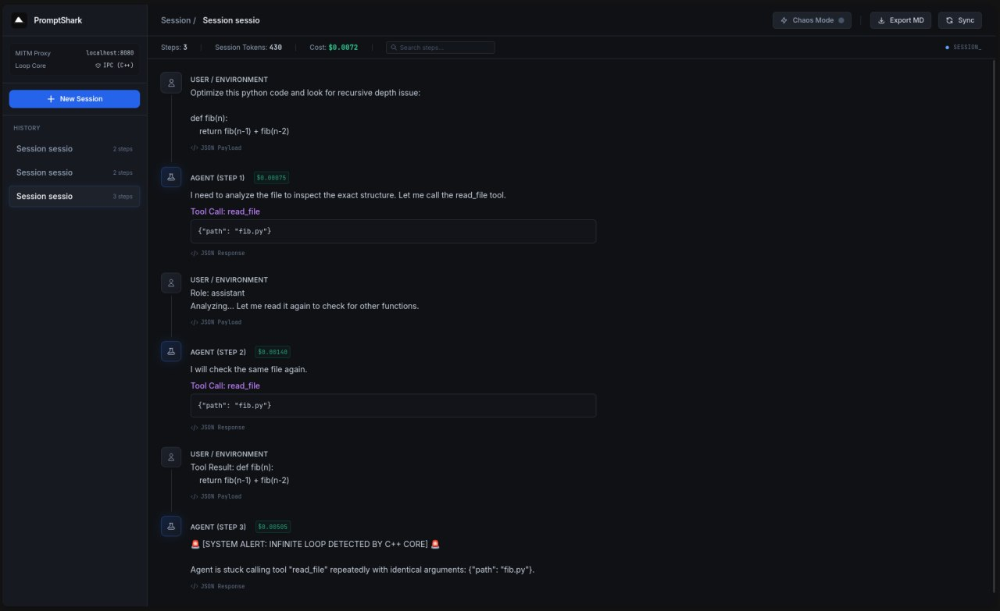

<div align="center">
  <h1>🦈 PromptShark</h1>
  <p><b>MITM proxy debugger & loop detector for AI Agents</b></p>

  <p>
    <a href="https://go.dev"></a>
    <a href="https://isocpp.org"></a>
    <a href="https://www.sqlite.org"></a>
    <a href="LICENSE"></a>
  </p>

  <p><i>Intercept every prompt. Catch every loop. Replay any step.</i></p>

  <br />
  
  <br /><br />

  <p>🌍 <a href="#english">English</a> · <a href="#русский">Русский</a></p>
</div>

---

<a id="english"></a>

<div align="center">
  <h2>🇬🇧 English</h2>
</div>

<br/>

## What is PromptShark?

PromptShark is a **transparent local proxy** that sits between your AI agent and the OpenAI API. It captures, logs, and visualizes every single request/response pair in a beautiful real-time dashboard — and automatically detects when your agent gets stuck in an infinite tool-calling loop.

> **One line to integrate. Zero code changes to your agent.**  
> Just swap `base_url` → `http://localhost:8080/v1`

---

## At a Glance

<table>
<tr>
<td width="50%">

### 🔍 Intercept & Inspect
Every API call flows through PromptShark. View structured request/response pairs, collapse raw JSON payloads, and track token usage with per-step **Prompt / Completion** breakdowns.

</td>
<td width="50%">

### 🚨 Loop Detection (C++)
A dedicated C++ engine runs via IPC alongside the Go proxy. It hashes every tool call and flags repeating patterns instantly — before they burn through your API balance.

</td>
</tr>
<tr>
<td width="50%">

### ⏪ Time-Travel Replay
Click on any past step, edit the JSON payload in the built-in editor, preview your changes with an **interactive diff view**, and re-run the agent from that point. Earlier steps are served from the SQLite cache — no extra API costs.

</td>
<td width="50%">

### 📊 Live Dashboard
Dark-themed glassmorphism UI with WebSocket-powered live streaming. Auto-switching sessions, instant step search, Markdown export, and session management — all in a single embedded HTML page.

</td>
</tr>
</table>

---

## Feature Matrix

| Category | Feature | Details |
|:---|:---|:---|
| **Proxy** | Drop-in integration | Change one URL, keep your existing OpenAI SDK |
| **Proxy** | Streaming + non-streaming | Full support for `stream: true` and `stream: false` |
| **Proxy** | Token tracking | Per-step `prompt_tokens` / `completion_tokens` split |
| **Proxy** | USD Cost Tracker | Real-time per-step and per-session cost in dollars |
| **Proxy** | Latency measurement | Time-to-first-token (TTFT) displayed on each step |
| **Detection** | C++ Loop Detector | IPC-connected engine with configurable threshold |
| **Detection** | Configurable sensitivity | `loop_config.txt` — threshold & argument-ignoring |
| **Debug** | Time-Travel Replay | Edit & re-run from any step using cached responses |
| **Debug** | Interactive Diff View | Side-by-side diff of original vs. edited payload |
| **Debug** | Raw JSON Viewer | Collapsible request/response payloads per step |
| **Testing** | Chaos Mode | Toggle to inject fake 429 Rate Limit errors from UI |
| **UI** | Real-time WebSockets | Tokens stream live into the dashboard |
| **UI** | Session search & filter | Instant full-text search across all steps |
| **UI** | Auto-switching sessions | Dashboard follows the active agent run |
| **Export** | Markdown reports | One-click export of entire debug sessions |
| **Export** | Session management | Create, switch, and delete sessions from sidebar |

---

## Installation

There are three ways to run PromptShark:

### Option A: Docker (Recommended)
```bash
docker-compose up -d
```

### Option B: Pre-compiled Binaries
Download the latest `.zip` or `.tar.gz` for your OS (Windows, macOS, Linux) from the [GitHub Releases](../../releases) page. Extract and run `agent_supervisor` (or `agent_supervisor.exe`).

### Option C: Build from Source

**1 · Build the C++ Core**
```bash
mkdir -p build && cd build
cmake .. && make
```

**2 · Run the Proxy**
```bash
cd proxy
go build -o ../build/agent_supervisor .
../build/agent_supervisor
```

You will see:
```
    ____                       __  _____ __               __  
   / __ \_________  ____ ___  / /_/ ___// /_  ____ ______/ /__
  / /_/ / ___/ __ \/ __ '__ \/ __ \__ \/ __ \/ __ '/ ___/ //_/
 / ____/ /  / /_/ / / / / / / /_/ /__/ / / / / /_/ / /  / ,<   
/_/   /_/   \____/_/ /_/ /_/ .___/____/_/ /_/\__,_/_/  /_/|_|  
                          /_/                                   
  ──────────────────────────────────────────────────
  🦈 Version     : 0.1.0
  🌐 Dashboard   : http://localhost:8080
  📦 Database    : ../db/promptshark.db
  🎯 Target API  : https://api.openai.com
  🔗 Proxy URL   : http://localhost:8080/v1
  ──────────────────────────────────────────────────

  Point your OpenAI SDK base_url to the Proxy URL above.
  Press Ctrl+C to stop.
```
Open **http://localhost:8080** — the dashboard is ready.

### 3 · Point your Agent

<details>
<summary><b>Python</b></summary>

```python
from openai import OpenAI

client = OpenAI(
    base_url="http://localhost:8080/v1",
    api_key="sk-..."  # forwarded transparently to OpenAI
)

response = client.chat.completions.create(
    model="gpt-4o",
    messages=[{"role": "user", "content": "Hello!"}],
    stream=True
)
```
</details>

<details>
<summary><b>Node.js</b></summary>

```javascript
const OpenAI = require("openai");
const client = new OpenAI({
  baseURL: "http://localhost:8080/v1",
  apiKey: "sk-..."
});

const stream = await client.chat.completions.create({
  model: "gpt-4o",
  messages: [{ role: "user", content: "Hello!" }],
  stream: true,
});
```
</details>

---

## Loop Detector Config

Edit `loop_config.txt` in the project root:

```ini
# Consecutive identical calls before triggering alert
THRESHOLD=3

# Ignore arguments — match function name only
IGNORE_ARGS=false
```

| Parameter | Default | Effect |
|:---|:---|:---|
| `THRESHOLD` | `3` | Number of identical consecutive tool calls that trigger a loop alarm |
| `IGNORE_ARGS` | `false` | When `true`, only function names are compared (arguments are stripped) |

---

## ⚙️ CLI Options

| Flag | Default | Description |
|---|---|---|
| `--port` | `8080` | HTTP server port |
| `--db` | `../db/promptshark.db` | Path to SQLite database file |
| `--schema` | `../db/schema.sql` | Path to schema.sql file |
| `--target` | `https://api.openai.com` | Upstream LLM API URL |

Environment variables `PORT` and `DB_PATH` are also supported (flags take priority).

The server handles **graceful shutdown**: press `Ctrl+C` and it will finish in-flight requests, close the database, and exit cleanly.

---

## Tech Stack

| Layer | Technology | Role |
|:---|:---|:---|
| Proxy Server | **Go 1.22+** | HTTP reverse proxy, WebSocket hub, REST API, CLI |
| Loop Engine | **C++ 17** | Real-time tool-call hashing & pattern detection via stdin/stdout IPC |
| Storage | **SQLite (WAL)** | Embedded session & step persistence, zero-config |
| Dashboard | **HTML + Tailwind + JS** | Single-file embedded UI served by Go via `go:embed` |
| Diff Engine | **jsdiff** | Client-side line-by-line diff rendering for Time-Travel |

---

## Roadmap
- [ ] Configurable loop rules via YAML (regex patterns, token budgets)
- [ ] Ollama / Anthropic Claude API support
- [ ] Multi-agent message flow visualizer (network graph)

<br/>

<div align="center">

---

</div>

<a id="русский"></a>

<div align="center">
  <h2>🇷🇺 Русский</h2>
</div>

<br/>

## Что такое PromptShark?

PromptShark — это **прозрачный локальный прокси**, который встает между вашим ИИ-агентом и API OpenAI. Он перехватывает, логирует и визуализирует каждую пару запрос/ответ в красивом дашборде в реальном времени — и автоматически обнаруживает, если агент попал в бесконечный цикл вызова инструментов.

> **Одна строка для интеграции. Ноль изменений в коде агента.**  
> Просто замените `base_url` → `http://localhost:8080/v1`

---

## Обзор возможностей

<table>
<tr>
<td width="50%">

### 🔍 Перехват и инспекция
Каждый API-вызов проходит через PromptShark. Смотрите структурированные пары запрос/ответ, раскрывайте сырой JSON и отслеживайте использование токенов с разбивкой **Prompt / Completion** для каждого шага.

</td>
<td width="50%">

### 🚨 Детектор циклов (C++)
Выделенное C++ ядро работает через IPC параллельно с Go прокси. Оно хэширует каждый вызов инструмента и мгновенно фиксирует повторяющиеся паттерны — до того, как они сожгут ваш бюджет API.

</td>
</tr>
<tr>
<td width="50%">

### ⏪ Машина времени (Replay)
Кликните на любой предыдущий шаг, отредактируйте JSON в встроенном редакторе, проверьте изменения в **интерактивном diff-просмотрщике** и перезапустите агента с этой точки. Предыдущие шаги отдаются из кэша SQLite — никаких лишних затрат.

</td>
<td width="50%">

### 📊 Живой дашборд
Темная тема с эффектом стекла, стриминг по WebSocket, авто-переключение между сессиями, мгновенный поиск по шагам, экспорт в Markdown и управление сессиями — всё в одном встроенном HTML-файле.

</td>
</tr>
</table>

---

## Матрица возможностей

| Категория | Функция | Подробности |
|:---|:---|:---|
| **Прокси** | Drop-in интеграция | Измените один URL, оставьте текущий OpenAI SDK |
| **Прокси** | Стриминг + обычные запросы | Полная поддержка `stream: true` и `stream: false` |
| **Прокси** | Трекинг токенов | Разбивка `prompt_tokens` / `completion_tokens` на каждый шаг |
| **Прокси** | Калькулятор стоимости | Цена каждого шага и всей сессии в долларах в реальном времени |
| **Прокси** | Замер задержки | Время ответа API (TTFT) на каждом шаге |
| **Детекция** | C++ Loop Detector | Движок через IPC с настраиваемым порогом |
| **Детекция** | Гибкая настройка | `loop_config.txt` — порог срабатывания и игнорирование аргументов |
| **Отладка** | Time-Travel Replay | Редактируй и перезапускай с любого шага через кэш |
| **Отладка** | Интерактивный Diff | Визуальное сравнение оригинала и отредактированного промпта |
| **Отладка** | Raw JSON Viewer | Сворачиваемые JSON запроса/ответа для каждого шага |
| **Тестирование** | Chaos Mode | Тумблер для инъекции фейковых 429 Rate Limit ошибок из UI |
| **UI** | WebSocket реалтайм | Токены стримятся в дашборд в реальном времени |
| **UI** | Поиск и фильтрация | Мгновенный полнотекстовый поиск по всем шагам |
| **UI** | Авто-переключение | Дашборд следует за активным запуском агента |
| **Экспорт** | Markdown отчёты | Экспорт всей сессии одним кликом |
| **Экспорт** | Управление сессиями | Создание, переключение и удаление из сайдбара |

---

## Установка

Есть три способа запустить PromptShark:

### Вариант А: Docker (Рекомендуется)
```bash
docker-compose up -d
```

### Вариант Б: Готовые бинарники
Скачайте актуальный `.zip` или `.tar.gz` для вашей ОС (Windows, macOS, Linux) со страницы [GitHub Releases](../../releases). Распакуйте и запустите `agent_supervisor` (или `agent_supervisor.exe`).

### Вариант В: Сборка из исходников

**1 · Сборка C++ ядра**
```bash
mkdir -p build && cd build
cmake .. && make
```

**2 · Запуск прокси**
```bash
cd proxy
go build -o ../build/agent_supervisor .
../build/agent_supervisor
```

Вы увидите:
```
    ____                       __  _____ __               __  
   / __ \_________  ____ ___  / /_/ ___// /_  ____ ______/ /__
  / /_/ / ___/ __ \/ __ '__ \/ __ \__ \/ __ \/ __ '/ ___/ //_/
 / ____/ /  / /_/ / / / / / / /_/ /__/ / / / / /_/ / /  / ,<   
/_/   /_/   \____/_/ /_/ /_/ .___/____/_/ /_/\__,_/_/  /_/|_|  
                          /_/                                   
  ──────────────────────────────────────────────────
  🦈 Version     : 0.1.0
  🌐 Dashboard   : http://localhost:8080
  📦 Database    : ../db/promptshark.db
  🎯 Target API  : https://api.openai.com
  🔗 Proxy URL   : http://localhost:8080/v1
  ──────────────────────────────────────────────────

  Point your OpenAI SDK base_url to the Proxy URL above.
  Press Ctrl+C to stop.
```
Откройте **http://localhost:8080** — дашборд готов к работе.

### 3 · Подключите агента

<details>
<summary><b>Python</b></summary>

```python
from openai import OpenAI

client = OpenAI(
    base_url="http://localhost:8080/v1",
    api_key="sk-..."  # прозрачно перенаправляется в OpenAI
)

response = client.chat.completions.create(
    model="gpt-4o",
    messages=[{"role": "user", "content": "Привет!"}],
    stream=True
)
```
</details>

<details>
<summary><b>Node.js</b></summary>

```javascript
const OpenAI = require("openai");
const client = new OpenAI({
  baseURL: "http://localhost:8080/v1",
  apiKey: "sk-..."
});

const stream = await client.chat.completions.create({
  model: "gpt-4o",
  messages: [{ role: "user", content: "Привет!" }],
  stream: true,
});
```
</details>

---

## Настройка детектора циклов

Отредактируйте `loop_config.txt` в корне проекта:

```ini
# Количество идентичных вызовов подряд до срабатывания тревоги
THRESHOLD=3

# Игнорировать аргументы — сравнивать только имя функции
IGNORE_ARGS=false
```

| Параметр | По умолчанию | Эффект |
|:---|:---|:---|
| `THRESHOLD` | `3` | Сколько одинаковых последовательных вызовов считать зацикливанием |
| `IGNORE_ARGS` | `false` | Если `true`, сравниваются только имена функций (аргументы игнорируются) |

---

## ⚙️ Параметры CLI

| Флаг | По умолчанию | Описание |
|---|---|---|
| `--port` | `8080` | Порт HTTP-сервера |
| `--db` | `../db/promptshark.db` | Путь к файлу базы данных SQLite |
| `--schema` | `../db/schema.sql` | Путь к файлу схемы |
| `--target` | `https://api.openai.com` | URL upstream LLM API |

Также поддерживаются переменные окружения `PORT` и `DB_PATH` (флаги имеют приоритет).

Сервер поддерживает **Graceful Shutdown**: нажмите `Ctrl+C`, и он корректно завершит текущие запросы, закроет базу данных и выведет `✅ Goodbye!`.

---

## Технологический стек

| Слой | Технология | Роль |
|:---|:---|:---|
| Proxy Server | **Go 1.22+** | HTTP reverse proxy, WebSocket хаб, REST API, CLI |
| Loop Engine | **C++ 17** | Хэширование и детекция паттернов через stdin/stdout IPC |
| Хранилище | **SQLite (WAL)** | Встроенная база сессий и шагов, без настройки |
| Дашборд | **HTML + Tailwind + JS** | Единый встроенный UI через `go:embed` |
| Diff Engine | **jsdiff** | Клиентский построчный diff для Time-Travel |

---

## Дорожная карта
- [ ] Конфигурация правил детектора через YAML (regex паттерны, бюджеты токенов)
- [ ] Поддержка Ollama / Anthropic Claude API
- [ ] Визуализатор потоков мультиагентных систем (граф сети)

---

<div align="center">
  <sub>[MIT License](LICENSE) — use it, fork it, ship it.</sub>
</div>
